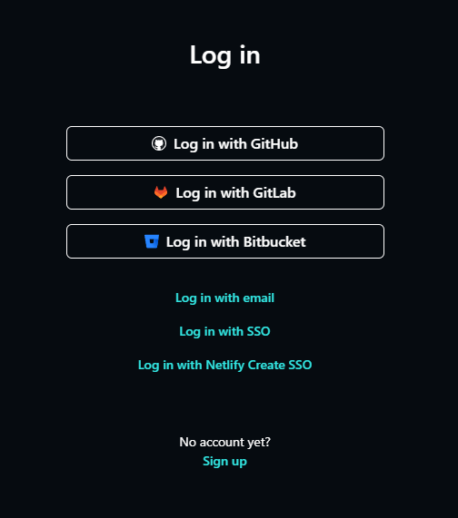
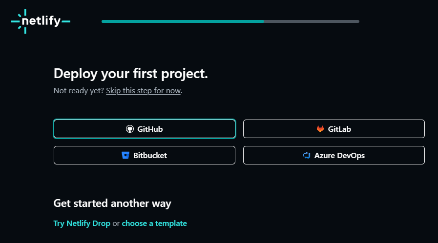
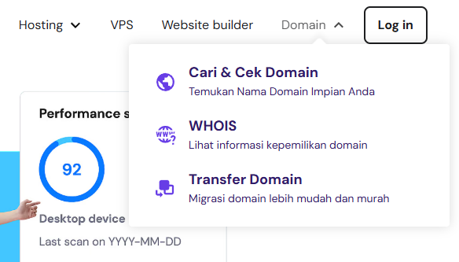
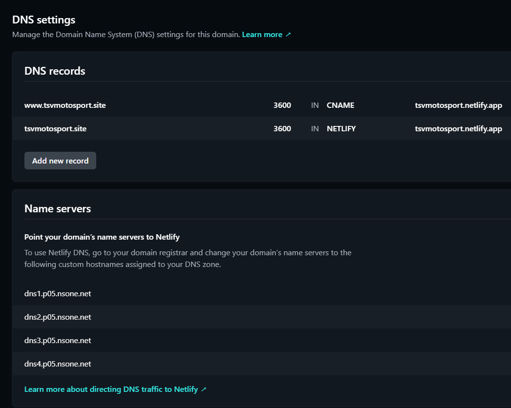
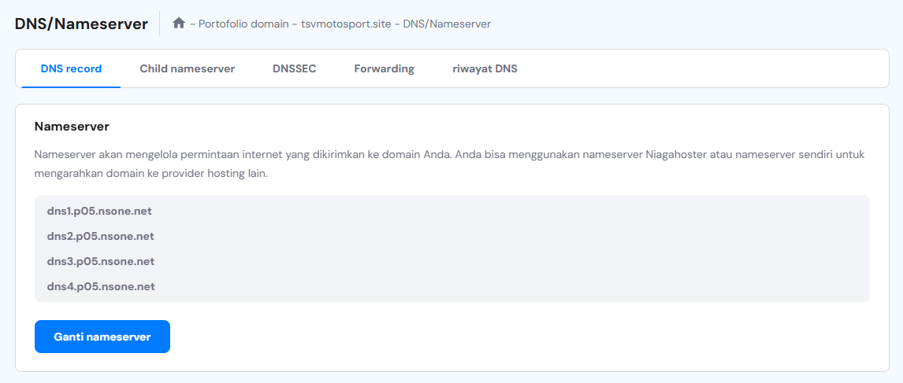
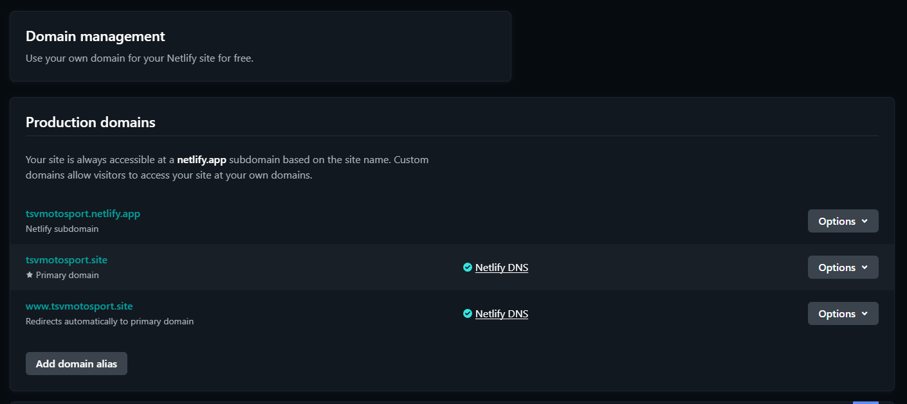

<h1 align="left">Welcome to TSV Auto !  </h1>

At TSV Auto, we’re redefining the automotive experience. Inspired by precision and strategy, we bring a new level of innovation and excellence to every aspect of your journey. From high-quality vehicle solutions to tailored services, our goal is to ensure every move you make is calculated and every ride is extraordinary.

Whether you're seeking performance, reliability, or cutting-edge design, TSV Auto is your trusted partner on the road to excellence. Join us as we blend passion, strategy, and technology to drive a smarter future.

## STRUCTURE 📰

- Header
  - Navbar
- Main
  - Hero section
  - About section
  - Product section
  - Blog section
  - Contact section
- Footer

## INGREDIENTS I USE 📜
- HTML
- CSS
- External/Internal Source
  - Image

## INSTALLATION 💻

If you want to try or develop this project, follow these steps:

1. Clone repository:
   ```bash
   git clone https://github.com/revou-fsse-oct24/milestone-1-BotanSy.git

2. Create a new branch named "develop", in this repository we would like to develop the website with personal information.
    ```bash
    git branch -b "develop"

3. Once it's created, checkout to a new branch
   ```bash
   gir checkout -b "develop"

4. Develop & modify the website with your personal information, once it's done you will need to push it.
   ```bash
   git add .
   git commit -m "(YourComment)" // make sure to give details commit message //
   git push origin develop


## CONTACT 📞

If you have any questions or suggestions, feel free to reach out to us via email at 
TsVmotosport@gmail.com

## DEPLOYMENT GUIDE ⚙️

The project has been successfully deployed using netlify. You can access the production version of the website following this link: https://tsvmotosport.site

### 1. Deploying Your Github to Netlify

1. **Sign up or log in Netlify:**

   - Go to Netlify and login or signup if you dont have an account.
   - 

2. **Link Gituhub Repository:**

   - Connect your Github account and grant netlify access to the repository. and Authorize.
   - Then Choose your sub-account that has the deployable web project and its is not a private repository for the netlify in the installed in.
   - 
   - Then select a repository to be deployed with netily
  

3. **Choose Repository and configure settings**

   - Select the repository you want to deploy.
   - Review configuration for your repository by selecting which **team** and the **Site name**, the site name shows up as the address for the deployed project, the check for the address availability by pressing the **check availability** button.
   - Select the branch to be deployed based on the branch you already deployed within Github environment.
   - Leave he rest empty and as is.

4. **Deploy Site:**

   - Click **Deploy site** and netlify will automatically start building and deploying the repository.
   - Once Complete, you'll get a default netlify domain 

### 2. Setting Up a Custom Domain

   1. **Purchase a domain:**

      - Go to domain register. like **niagahoster**, and buy a domain name that suits your project.
      - 
      - Check for the  domain availability.
      - Choose 1 yer duration, and fill in billing form
      - choose your payment option, then proceed.
      - Register your domain with your country and select "Personal" usage, and fill in your contact address.
      - Then wait for a while until the domain finishes registering and online

   2. **Add Custom domain in Netlify:**

      - In your netlify dashboard, go to **site setting > Domain management.**
      - 
      - Under **Custon domain** click **add domain** and enter your purchased domain.
  
   3. **Verify Domain Ownership (if required):**

      - Netlify might require verification fo the custom domain. follow any instructions Netlify provides for verification.

## 3. Updating Domain Nameservers to point to Netlify

   1. **Get Netlify Nameservers:**

      - After adding the domain in Netlify, Netlify will provide a set nameservers. copy these nameservers.
      - 

   2. **Change Nameservers at your Domain** 

      - log into the account where you purchased the domain
      - Locale **DNS settings, Nameserver** options.
      - **Replace** the existing nameservers with the netlify nameservers privided.
      - This proceed requires around 1 to 24 hours so make sure you proceed this step carefully.
      - 

   3. **Save changes and Allow for Propagations**

      - save the new nameservers settings. Domain changes can take up to 24hours to propagate globally.

### 4. Confirm Deployment and Access Your Site

   - After propagation, the changes of your site should be applied and accesible via your custom domain.
   - 
   - Test your site in a browser to confirm everything is set up corretly.


[](https://classroom.github.com/a/dyiPpHu0)
